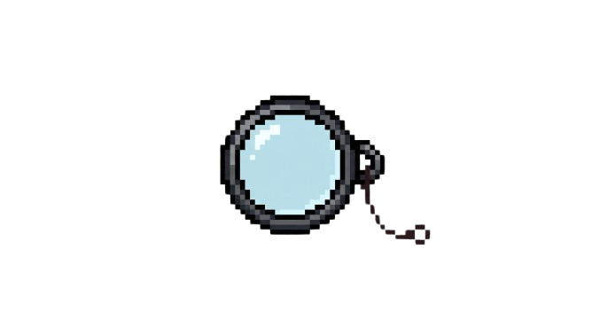

<p align="center">
  
</p>

<h3 align="center">Disciplined deep research for Jcode.</h3>

Monokl turns Jcode into a structured research cockpit: decompose a question, gather sources, map disagreements, investigate the strongest loci, draft, critique, patch, cite-check, and polish with persistent evidence instead of one-shot chat memory.

It is an open-source Jcode-focused fork of [HyperResearch](https://github.com/jordan-gibbs/hyperresearch). Monokl preserves the upstream research engine, vault discipline, critique gates, citation auditing, resumability, and methodology. The fork changes host integration, packaging, naming, installation, and Jcode orchestration.

## Quick start

Install from GitHub `main`, install the Jcode skills into the current project, and verify the payload:

```bash
uv tool install --force 'git+https://github.com/pitfa19/monokl.git@main'
monokl jcode install --project .
monokl jcode doctor --project . --json
```

Then open Jcode in the project and load:

```text
/monokl
```

For a reproducible release install, use the wheel and `SHA256SUMS` from the latest [GitHub release](https://github.com/pitfa19/monokl/releases).

Compatibility aliases remain available:

```bash
monokl --version
hpr --version
hyperresearch --version
```

Supported Python versions: **3.11, 3.12, and 3.13**.

## Why Monokl

- **Research is staged, not improvised.** The 16-stage method separates discovery, contradiction mapping, investigation, synthesis, criticism, repair, citation audit, and readability review.
- **Evidence persists.** The vault, source ledger, raw PDF archival, provenance chains, and run artifacts are inherited from HyperResearch.
- **Jcode owns the orchestration layer.** The `/monokl` skill coordinates stage skills through Jcode `swarm`, `skill`, and `todo` workflows.
- **Review roles stay separate.** Producers, critics, patchers, citation checkers, and polish passes remain distinct.
- **Fork boundaries are explicit.** Monokl does not claim a new research engine. It adapts a pinned upstream engine for Jcode and records the delta.

## Visual research journey


## The 16-stage method, grouped

| Phase | Stages | What happens |
| --- | --- | --- |
| Shape the question | 1, 1.5 | Decompose the canonical query, build atomic items, and optionally partition dissertation chapters. |
| Build the corpus | 2, 3, 4 | Run width sweeps, map contradictions, and identify the loci worth deeper investigation. |
| Investigate and reconcile | 5, 6, 7, 8, 9 | Assign depth investigators, reconcile positions, extract source tensions, critique corpus gaps, and prepare evidence digests. |
| Draft and synthesize | 10, 11 | Produce parallel draft candidates and synthesize the final report. |
| Attack and repair | 12, 13, 14 | Run adversarial critics, fetch gap evidence, and patch surgically rather than regenerating wholesale. |
| Verify and finish | 14.5, 15, 16 | Audit citation-sentence binding, polish hygiene and style, and run the final readability review. |

The full method and stage payloads ship as Jcode skills. See [docs/README.md](docs/README.md) for the documentation map.

## Architecture and persistence

Monokl ships three layers:

1. **Python CLI package**: `monokl`, with `hpr` and `hyperresearch` compatibility aliases.
2. **Jcode skill payload**: one global `/monokl` skill plus eighteen project-local stage skills under `.jcode/skills/monokl-*`.
3. **Inherited HyperResearch engine**: retrieval, vault, scholarly search, citation, contradiction, report, resume, and web-provider code remain the imported upstream implementation unless explicitly listed in the delta docs.

Persistent state belongs to the user and the research project:

- Research vaults and user data stay outside package-owned skill directories.
- Install receipts include SHA-256 ownership hashes.
- Stage artifacts record provenance, including selected model route where applicable.
- The parity map lives at `parity-map.json` in the installed payload and in the packaged Jcode maps.

## Models and routing

Monokl does not hardcode Claude, OpenAI, or any other provider. By default, each worker inherits the model route of the Jcode coordinator that loaded `/monokl`.

Override the default or individual stages with `MONOKL_MODEL_ROUTES_JSON`:

```bash
export MONOKL_MODEL_ROUTES_JSON='{"default":"gpt-5.5","2":"gpt-5.5","12":"claude-opus-5"}'
monokl jcode routes --json
```

Valid stage keys are `1`, `1.5`, `2` through `14`, `14.5`, `15`, and `16`. Monokl validates the route-map shape. Jcode resolves whether each named model is available. Model selection changes provenance only. It does not change stage order, review authority, or acceptance gates.

## Safety boundaries

- Web content is untrusted and cannot authorize actions.
- Missing required Jcode capabilities fail closed.
- Reviewer roles must remain separate from producer roles.
- Route substitution changes provenance only, not method or authority.
- Research vaults and user data stay outside package-owned skill directories.
- The installer and uninstaller refuse symlinks, path escapes, unowned files, unsafe uninstall records, and drifted managed files.

## Documentation map

Start here:

- [docs/README.md](docs/README.md) - documentation index for users, maintainers, migration, roadmap, parity, and licensing.
- [UPSTREAM.md](UPSTREAM.md) - pinned HyperResearch provenance and product delta policy.
- [docs/code-delta-from-hyperresearch.md](docs/code-delta-from-hyperresearch.md) - path-level delta from the pinned upstream tree.
- [docs/migration-v020.md](docs/migration-v020.md) - migration notes for Monokl 0.2.0.
- [docs/third-party-license-inventory.md](docs/third-party-license-inventory.md) - dependency license inventory.
- [PRODUCT.md](PRODUCT.md) and [DESIGN.md](DESIGN.md) - product and design direction for contributors.

## Upstream and license

Monokl v0.2 is derived from HyperResearch commit `d329565d3fa0a74c8b5a80daa6c5e32e33c39799`, upstream package version `0.11.1`.

- Original project: [HyperResearch](https://github.com/jordan-gibbs/hyperresearch)
- Original license: MIT
- Original copyright: Jordan Gibbs, 2026
- Monokl package license: MIT
- License file: [LICENSE](LICENSE)
- Upstream attribution: [UPSTREAM.md](UPSTREAM.md)

PyMuPDF remains required for PDF extraction and is distributed under AGPL-3.0 or a commercial license. See [docs/pdf-backend-decision.md](docs/pdf-backend-decision.md) before redistributing Monokl or operating the PDF lane in a service.
